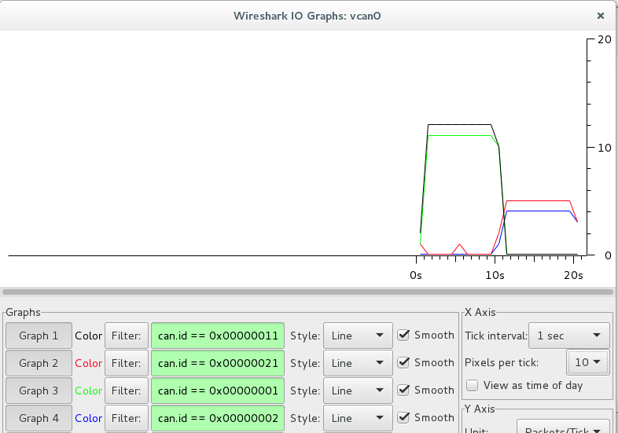
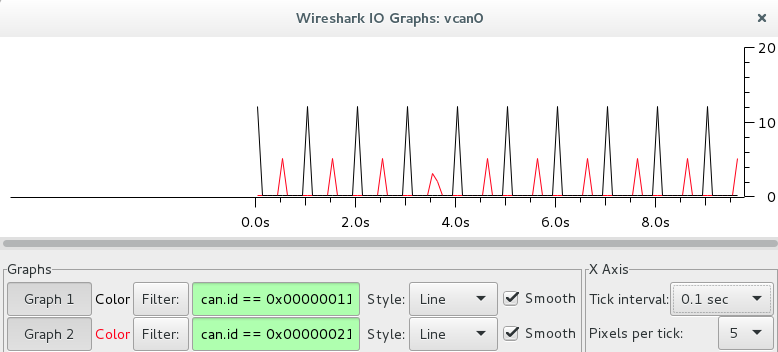
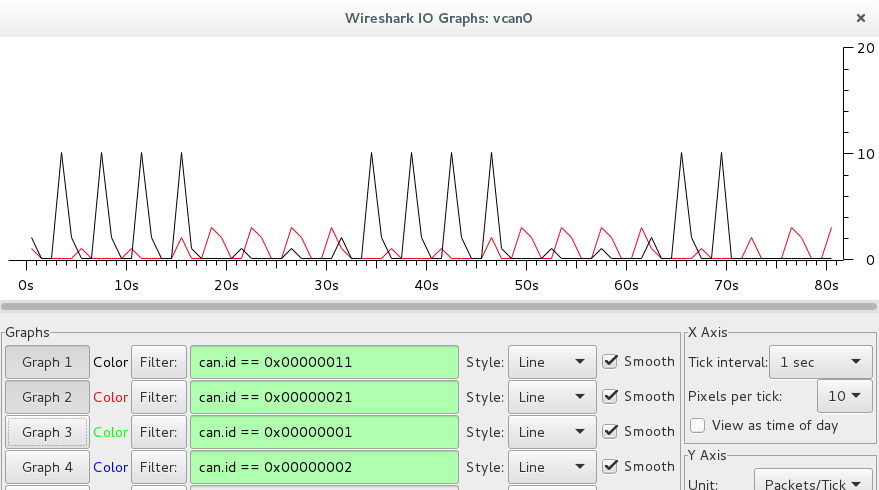
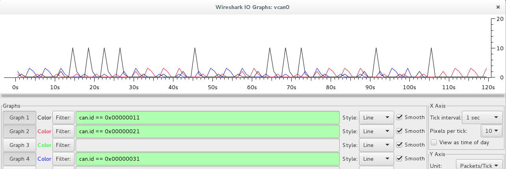

# Bilder Erklärung

## Test: Trennung der Anfragen durch die App-SGs

Grafik zeigt, wie die Zugriffe auf das HMI-SG verteilt sind.  
Hierbei stellten die SG ihre 10 Anfragen direkt hintereinander.  

Gleicher versuch ohne künstliche Bearbeitungszeit des HMI-SG durch Sleep  

Hier haben die Apps nach jeder beantworteten Anfrage 1 Sekunde lang geschlafen.  
Hierdurch wird ein ineinandergreifen der Anfragen ermöglicht.  
Diese 1 Sekunde kann als Bearbeitungszeit der A-SG angesehen werden.  

3 Apps stellen zeitgleich eine Request.
Wird ihre Request beantwortet, schlafen sie 1 Sekunde.
Hierdruch können Anfragen überlappen.
Die Wahrscheinlichkeit einer Überlappung hängt vom Timeout der A-SG-Anfragen ab.
